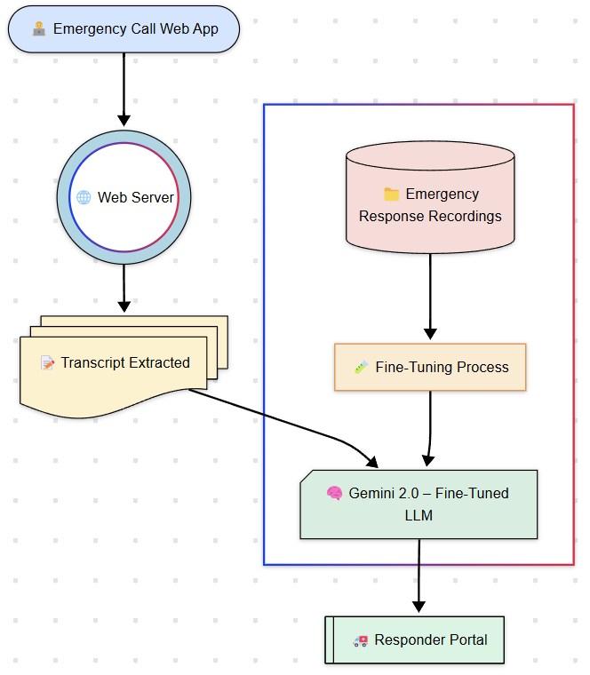

# 🎙️ Florian AI Web Application

A web-based AI voice responder that interacts with emergency callers when human responders are busy. This system acts as the **frontline AI triage agent**, calming the caller and extracting crucial information in real-time.

> This is the data ingestion layer of the Florian ecosystem. The output from this application is passed to the [Florian AI Dashboard](https://github.com/Deepakv1210/florian-ai-dashboard) for analysis and visualization.

---

## 💡 What It Does

- Uses speech recognition to process real-time emergency calls
- Interacts with distressed callers through an empathic AI voice assistant
- Extracts a full transcript of the conversation
- Sends the transcript to a fine-tuned Gemini 2.0 model for severity analysis and alert generation

---

## 🎥 AI Responder in Action  

**Demo 1**  
[](https://youtu.be/VM2yeWjZWgg)

**Demo 2**  
[](https://youtu.be/damIPy4Vvt8)

---

## 🧭 System Flow Overview

Here’s how the Florian AI Web App processes emergency calls and routes them to responders through the LLM pipeline:



---

## Installation

After installing node.js, install the required dependencies:

```bash
npm install
```

## Usage

To run the server:

```bash
npm run dev
```

Server runs on port 3000.

---

## 💡 Why Florian?

Named after **Saint Florian**, the patron saint of first responders, this system is built to **honor the bravery of emergency workers** and provide them with AI-enhanced tools to save lives more efficiently.

---

